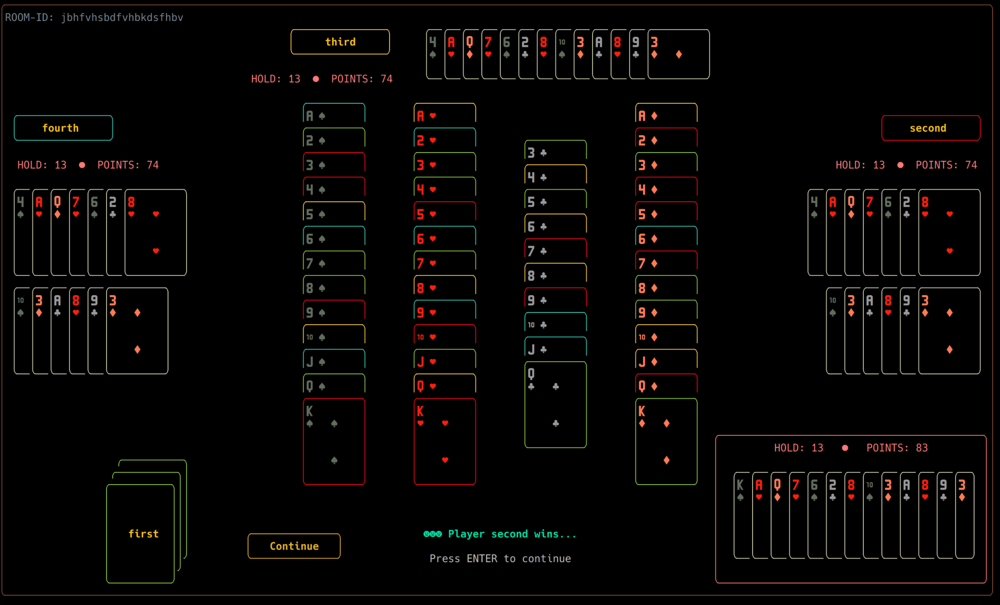
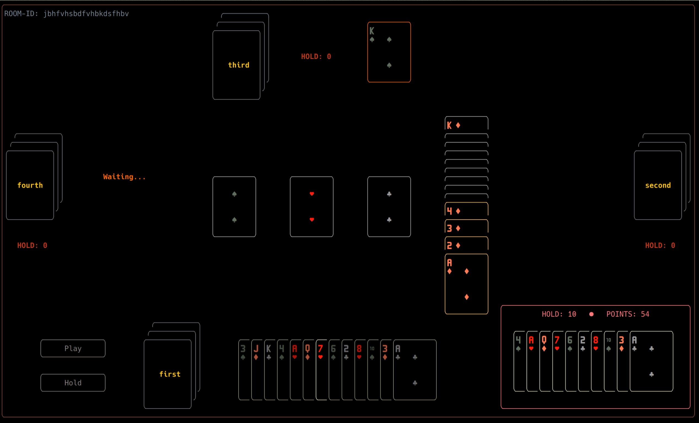

# heart7 - 扑克牌游戏 “憋七” 的Rust实现
- 效果图

  

  

- Requirements

  - Nerd Fonts
  - 一个现代的终端模拟器，比如alacritty、kitty等
  - 不保证Windows上的编译、运行和显示

- 实现

  - C/S架构，通信使用gRPC（tonic + tokio）
  - 界面显示使用TUI（ratatui + crossterm）

- 编译运行

  - `cargo build --release`
  - 运行服务端`heart7d --listen <IP:PORT>`，不加参数默认监听`0.0.0.0:20007`
    - log在stdout
  - 运行客户端`heart7`，根据页面提示操作
    - 默认日志在`heart7.log`，可以通过环境变量LOGFILE来设置

- 客户端操作

  - 全键盘操作，支持动态调整终端大小，最小需要160*48
  - 通过上下左右键移动光标位置（有高亮提示），ENTER键确认
  - 输入框支持左右方向键、DELETE和BACKSPACE
  - 连接服务器：输入服务端地址
  - 输入用户名，选择创建房间或者加入已有房间
  - 创建房间需输入房间名，不能与其他房间名重复
  - 加入房间后等待4位玩家到齐，按ENTER键确认准备开始
  - 游戏过程中，通过上下键选择是出牌或者扣牌，通过左右键调整选定的牌
    - 能接的牌有实时高亮显示，无牌可接会有提示
    - 画面右下角列出了自己扣掉的牌，其他玩家的名字附近标有其扣牌数量
    - 牌桌（画面中央）上显示花色排列的状态，黄色高亮的表示本轮出牌，绿色高亮表示本轮自己出牌
  - 游戏结束画面包括：
    - 游戏胜负
    - 每位玩家的扣牌
    - 牌桌上接出的牌的具体状态，每张牌高亮的颜色用于区分是谁接的牌（每个玩家对应的颜色在其名字上标出）
    - 按ENTER继续游戏
  - 在任意状态下，按ESC可调出菜单，选择退出游戏、退出房间、退出程序

- “憋七”的游戏规则

  - 4位玩家平均发52张牌（不含大小王），每人13张，轮流出牌，在桌面上形成4种花色的A到K的排列
  - 每种花色的排列从7开始，向两侧延伸
  - 发到红桃7的玩家先出牌，按逆时针依次出牌（PLAY）
  - 如果没有牌可以接，需要扣牌（HOLD）
  - 只要有牌接，就不可以扣牌
  - 7不可以扣
  - 最终计算每位玩家的扣牌总点数（A-K对应1-13），总点数最少的玩家获胜
  - 如果某位玩家没有扣牌，则称“净手”（CLEAR）
